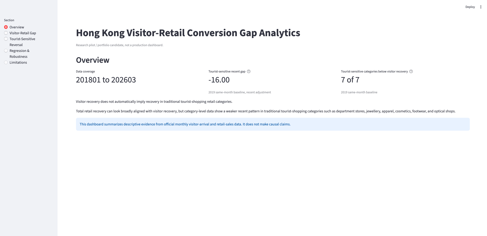
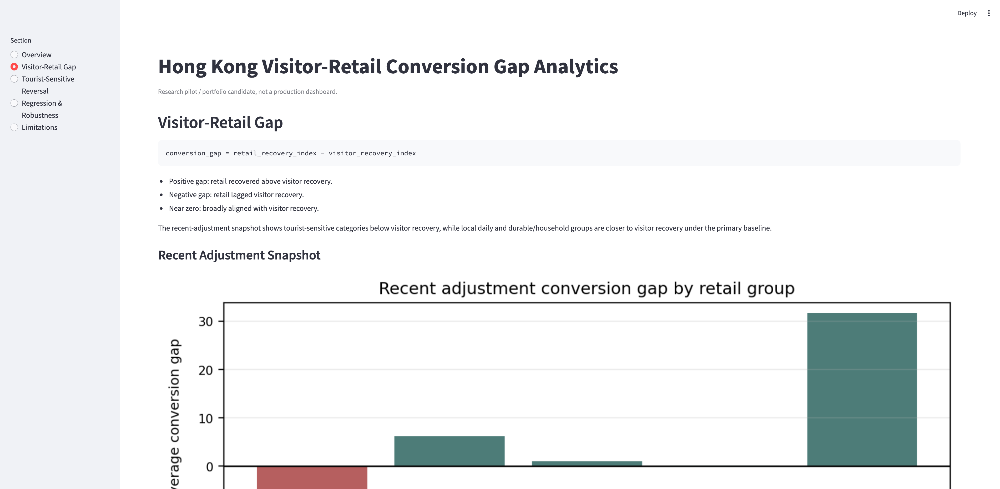
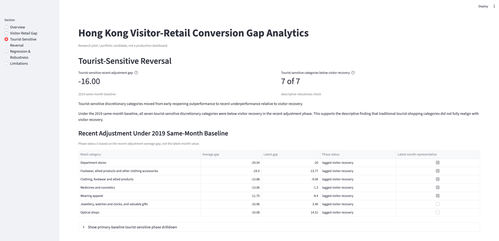

# Hong Kong Visitor-Retail Conversion Gap Analytics

A public-data analytics project examining whether Hong Kong's post-reopening visitor recovery aligned with retail category recovery.

## Core Question

Did visitor recovery translate evenly across retail categories, or did tourist-sensitive and local-consumption categories follow different recovery paths?

## Key Findings

This is a research pilot, and the findings should be read as descriptive evidence rather than causal inference.

- Total retail masks category-level differences.
- Tourist-sensitive discretionary retail shifted from early outperformance to broad recent underperformance relative to visitor recovery.
- The tourist-sensitive reversal is robust to baseline choice:
  - Baseline A: 2018-2019 average = 100.
  - Baseline B: 2019 same-month = 100.
- Local daily and durable/household interpretations are more baseline-sensitive and closer to visitor recovery.
- Visitor recovery alone has weak explanatory fit. Group and phase structure are more informative for describing category-specific recovery patterns.

Practical reading: total retail recovery should be treated as a benchmark, not as a sufficient signal for visitor-facing category recovery.

Current Interpretation:

```text
Total retail masks category-specific recovery paths. Tourist-sensitive discretionary categories moved from early reopening outperformance to recent underperformance relative to visitor recovery, and this reversal is robust to the same-month 2019 baseline check. Local daily and durable/household categories are closer to visitor recovery and more baseline-sensitive, so they should be interpreted more cautiously.
```

## Dashboard Preview

### Overview



### Visitor-Retail Gap



### Tourist-Sensitive Reversal



## Data

The current visitor-retail layer uses official Hong Kong Census and Statistics Department public data:

- C&SD visitor arrivals table `650-80001`.
- C&SD retail sales table `620-67002`.
- Coverage in the current processed pilot outputs: `201801` to `202603`.

The project uses aggregate monthly public data only. It does not include transaction-level data or tourist-spending microdata.

## Data Access

Raw official datasets are not redistributed in this repository. To reproduce the project, obtain the C&SD source payloads locally and save them under the expected `data/raw/` filenames before running the preprocessing script.

See `docs/raw_data_acquisition.md` for the required tables, expected local filenames, and preprocessing notes.

## Methods

The pipeline currently covers:

- C&SD API JSON extraction and preprocessing into normalized CSV files.
- Recovery index construction.
- Visitor-retail conversion gap calculation.
- Rule-based retail category grouping documented in `config/retail_category_groups.yaml`.
- Phase segmentation.
- Category and group drilldown analysis.
- Descriptive regression.
- Baseline sensitivity checks.

### Conversion Gap Formula

```text
gap = retail_recovery_index - visitor_recovery_index
```

Interpretation:

- Positive gap: retail recovered above visitor recovery.
- Negative gap: retail lagged visitor recovery.
- Near zero: broadly aligned with visitor recovery.

## Main Outputs

Documentation:

- `docs/executive_summary.md`
- `docs/current_findings.md`
- `docs/methodology.md`
- `docs/limitations.md`
- `docs/raw_data_acquisition.md`

Generated tables and figures:

- `outputs/tables/`
- `outputs/figures/`

These folders are generated locally after running the pipeline and are not committed except for `.gitkeep` placeholders.

Key generated tables include recovery panels, category and group gap diagnostics, descriptive regression summaries, and baseline sensitivity outputs.

## Limitations

- The analysis is descriptive, not causal.
- Monthly aggregation can hide shorter timing differences and within-month changes.
- The project does not use transaction-level data.
- The project does not use tourist-spending microdata.
- Retail category grouping requires judgment, and some categories are ambiguous.
- Local daily and durable/household findings are baseline-sensitive.
- The post-reopening regression layer includes a model with a high condition number, so that result is limited.
- Hotel and event modules are not included in the current analysis.
- This is an analytics pilot, not a recommendation document.

## How To Reproduce

Obtain the raw official C&SD payloads first; see `docs/raw_data_acquisition.md`.

Recommended one-command pipeline:

```bash
python src/pipeline.py
```

The detailed script order is:

```bash
python src/preprocess_censd_json.py
python src/visitor_retail_pilot.py
python src/grouped_retail_gap_analysis.py
python src/retail_group_phase_analysis.py
python src/tourist_sensitive_drilldown.py
python src/local_daily_durable_drilldown.py
python src/regression_robustness.py
python src/baseline_sensitivity.py
```

The raw C&SD API JSON payloads should already be present in `data/raw/` before preprocessing. The baseline sensitivity script writes separate output files and does not overwrite the primary baseline outputs.

Generated tables and figures are ignored by design. Run the full pipeline before launching the dashboard, because the dashboard reads regenerated files from `outputs/tables/`.

## How To Run Dashboard Locally

```bash
streamlit run app/streamlit_app.py
```

Run the reproduction scripts first so the dashboard can read the generated tables in `outputs/tables/`.

## Project Status

Research pilot / portfolio candidate, not a final production dashboard.

The current scope is visitor-retail category mismatch only. Hotel and event modules are intentionally excluded from the present results.

## License

Code is released under the MIT License. Official datasets are not covered by this code license.

## Public Data Disclaimer

This repository does not redistribute raw official datasets. Users should obtain official data from the original public sources. Official statistics remain the property of their respective publishers.
